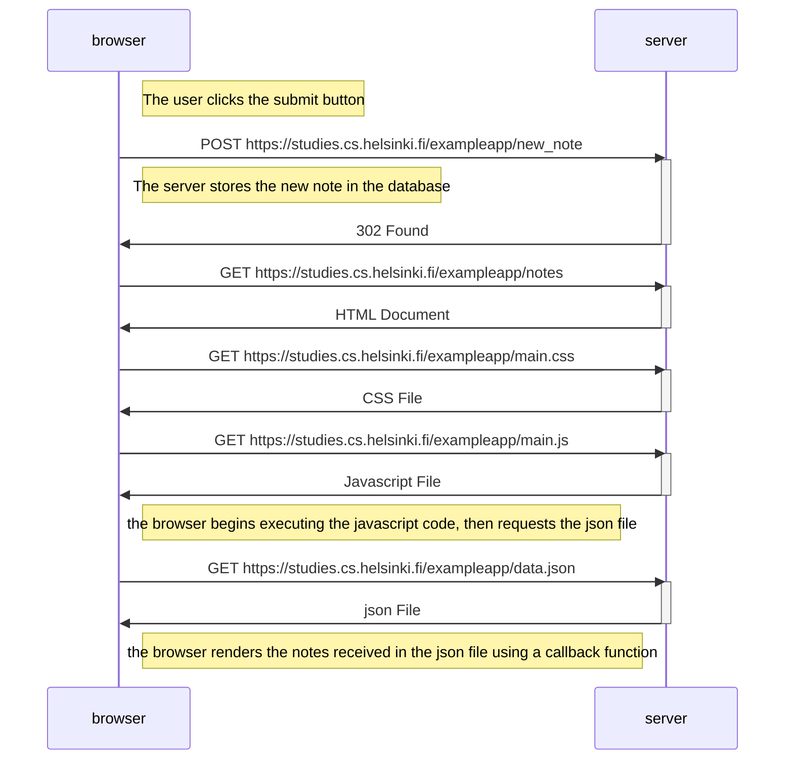

```mermaid

    sequenceDiagram
    participant browser
    participant server
    Note right of browser: The user clicks the submit button
    browser->>server: POST https://studies.cs.helsinki.fi/exampleapp/new_note

    activate server
    Note right of browser: The server stores the new note in the database
    server->>browser: 302 Found
    deactivate server

    browser->>server: GET https://studies.cs.helsinki.fi/exampleapp/notes
    activate server
    server->>browser: HTML Document
    deactivate server

    browser->>server: GET https://studies.cs.helsinki.fi/exampleapp/main.css
    activate server
    server->>browser: CSS File
    deactivate server

    browser->>server: GET https://studies.cs.helsinki.fi/exampleapp/main.js
    activate server
    server->>browser: Javascript File
    deactivate server

    Note right of browser: the browser begins executing the javascript code, then requests the json file

    browser->>server: GET https://studies.cs.helsinki.fi/exampleapp/data.json
    activate server
    server->>browser: json File
    deactivate server

    Note right of browser: the browser renders the notes received in the json file using a callback function
```
