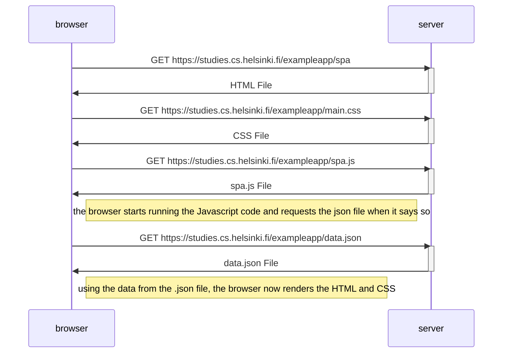

```mermaid
    sequenceDiagram
      participant browser
      participant server

      browser->>server: GET https://studies.cs.helsinki.fi/exampleapp/spa
      activate server
      server->>browser: HTML File
      deactivate server

      browser->>server: GET https://studies.cs.helsinki.fi/exampleapp/main.css
      activate server
      server->>browser: CSS File
      deactivate server

      browser->>server: GET https://studies.cs.helsinki.fi/exampleapp/spa.js
      activate server
      server->>browser: spa.js File
      deactivate server

      Note right of browser: the browser starts running the Javascript code and requests the json file when it says so

      browser->>server: GET https://studies.cs.helsinki.fi/exampleapp/data.json
      activate server
      server->>browser: data.json File
      deactivate server

      Note right of browser: using the data from the .json file, the browser now renders the HTML and CSS
```
