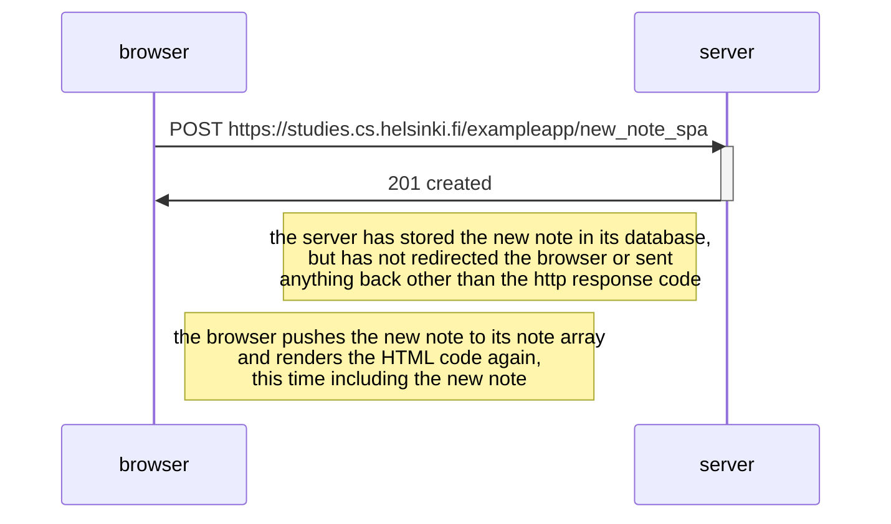

```mermaid
    sequenceDiagram
    participant browser
    participant server
      browser->>server: POST https://studies.cs.helsinki.fi/exampleapp/new_note_spa
      activate server
      server->>browser: 201 created
      deactivate server

      Note left of server: the server has stored the new note in its database, <br> but has not redirected the browser or sent <br> anything back other than the http response code

      Note right of browser: the browser pushes the new note to its note array <br> and renders the HTML code again, <br> this time including the new note
```
